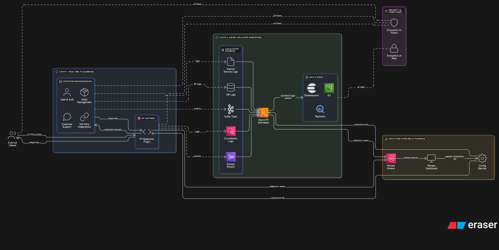

# Deployment Strategy Proposal

### 1. Executive Summary

The core vulnerability at Flixkart stems from PII leaking through unmonitored assets, specifically logs and API endpoints. To address this in real-time without impacting performance, we propose a **two-pronged, defense-in-depth strategy**:

1. **Primary Defense (Real-time): An API Gateway Plugin** to scan and redact PII from all ingress and egress traffic centrally.
2. **Secondary Defense (Asynchronous): A Log/Stream Sanitizer** to scrub PII from internal logs and data streams, ensuring data is clean before it reaches analytics platforms or data lakes.

This hybrid model provides comprehensive, real-time protection at the network edge while ensuring internal data-at-rest is also sanitized, directly mitigating the risks that led to the fraud incidents.

### 2. Analysis of Architecture & Vulnerabilities

The provided architecture shows a standard microservices pattern where an **API Gateway** acts as the single entry point for external traffic. The "external API integration" logs and "unmonitored endpoints" mentioned in the incident report represent critical blind spots. The goal is to intercept PII before it can be logged or stored in plain text.

### 3. Proposed Solution: A Hybrid Deployment Model

### Layer 1: Real-time Scanning at the API Gateway

The most effective place to enforce a real-time PII security policy is at the **API Gateway**.

- **Implementation:** We will develop a high-performance custom plugin for our API Gateway (e.g., a Lua script for Kong/NGINX, or a custom Lambda authorizer/integration for AWS API Gateway). The core PII detection logic from the Python PoC will be ported to a language optimized for low-latency network processing (like Go, Rust, or LuaJIT).
- **How it Works:** The plugin will inspect the request and response bodies of all API calls passing through the gateway. If PII is detected based on the defined rules, it will be redacted *in-flight* before the data is passed to the upstream microservice or returned to the client. This immediately stops PII from being stored in service logs or rendered in internal tools.
- **Justification:**
    - **Scalability:** API Gateways are designed for high-throughput and horizontal scaling. Our plugin inherits this scalability.
    - **Low Latency:** By using a performant language and optimized regex, the added latency can be kept to a minimum (typically <10ms per request). Advanced techniques like using a Bloom filter can pre-screen requests to avoid running expensive regex on every call.
    - **Centralized Control:** A single point of deployment and management ensures the PII policy is applied universally, eliminating endpoint blind spots.
    - **Ease of Integration:** It is application-agnostic. Microservice teams do not need to import any new libraries or change their code, leading to rapid adoption.

### Layer 2: Asynchronous Log & Data Stream Sanitation

While the API gateway protects the edge, we need a mechanism to handle internal data flows and provide a second layer of defense.

- **Implementation:** An asynchronous process will scan logs and event streams. This can be implemented as:
    - A **serverless function** (e.g., AWS Lambda) triggered by new entries in CloudWatch Logs or a Kinesis stream.
    - A dedicated microservice that consumes from a central logging topic in **Kafka** or a similar message bus.
- **How it Works:** This service uses the same PII detection logic to scan log entries and messages *after* they have been generated but *before* they are indexed in a search engine (like Elasticsearch) or loaded into the data lake (like S3/BigQuery). It redacts any PII found in place.
- **Justification:**
    - **Zero Performance Impact:** This process runs out-of-band and adds zero latency to the critical application request path.
    - **Defense-in-Depth:** It catches PII from sources that might not pass through the main API Gateway, such as internal service-to-service communications, cron jobs, or database logs.
    - **Cost-Effectiveness:** It leverages scalable, event-driven, and often pay-per-use infrastructure, making it highly cost-effective.

### 4. Deployment Strategy Flowchart

The following flowchart illustrates the two-layered defense strategy, showing how data flows through both the real-time and asynchronous PII redaction layers.

### 5. Conclusion

This hybrid strategy provides a robust and layered defense against PII leaks. The **API Gateway plugin** acts as our real-time shield, preventing PII from entering or leaving our ecosystem unprotected. The **asynchronous log scanner** acts as our sanitation crew, ensuring that data at rest is clean and secure. This combined approach effectively closes the security gaps, prevents future fraud, and builds a more secure foundation for Flixkart's operations.